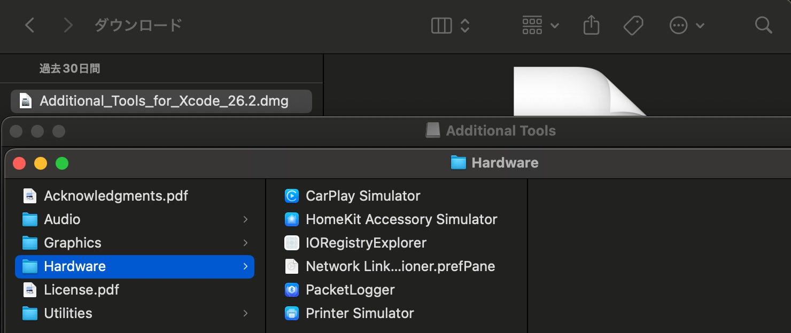
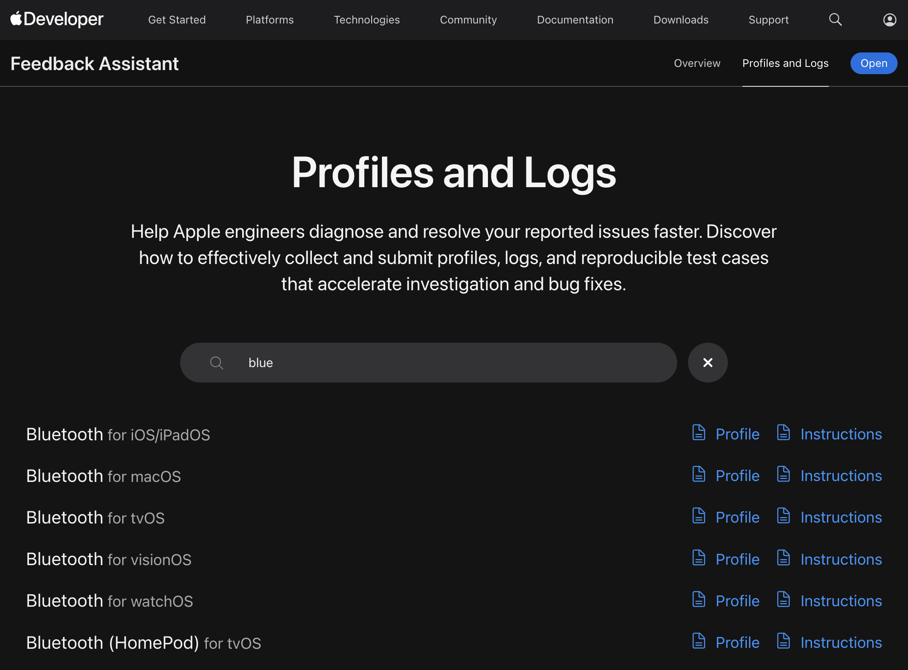
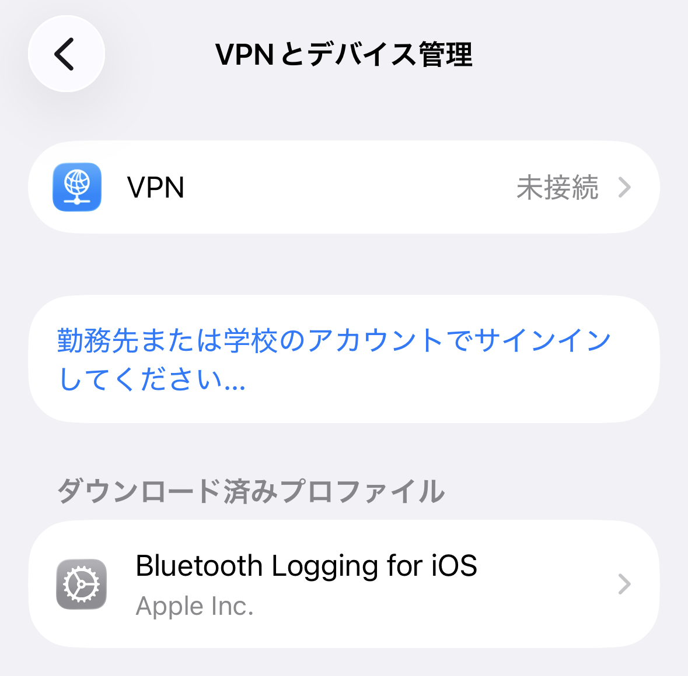
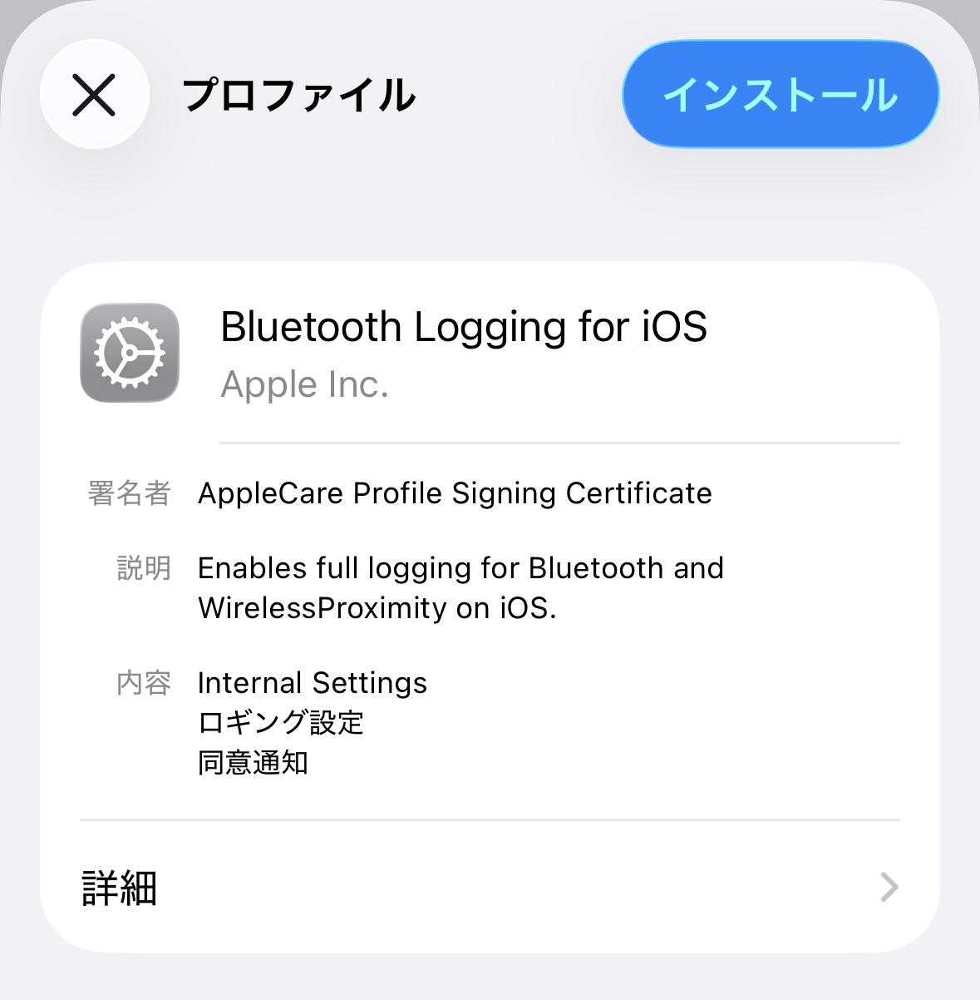
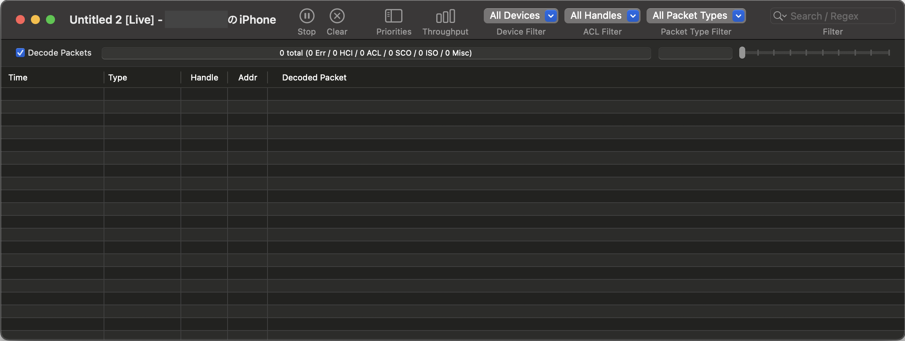
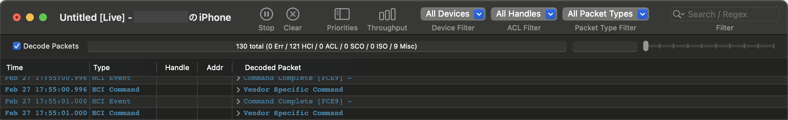
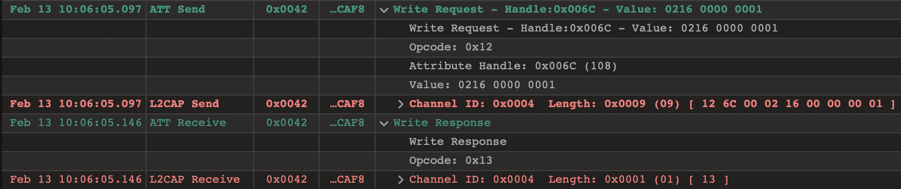

  
PacketLogger を使って BLE 通信の中身を覗いてみる

  
akatsuki174

# PacketLogger を使って BLE 通信の中身を覗いてみる

BLE（Bluetooth Low Energy）を使ったアプリやデバイス開発をしていると、接続はできているはずなのに想定したデータが返ってこないなどのハプニングに遭遇することがあると思います。そんな時に役立つツールの1つが PacketLogger です。

私は iOS アプリ実装をする中で Apple Notification Center Service（ANCS）を使っていたのですが、通知に対してアクションを起こす命令を送っても期待した動作にならないことに悩まされていました。Xcode 上で見る限りは送っているパケットは合っているように見えるし、エラーが返ってきているわけでもない。これ以上 Xcode 上で悩んでも仕方ないなと思い、PacketLogger を使うに至りました。

わりと便利なツールだと思ったので、この記事では PacketLogger の概要から使い方までを紹介してみたいと思います。

※ ここから先は iPhone における BLE 通信デバッグを前提として記述します。この他に Mac、Apple Watch などでも活用できるはずです。

## PacketLogger とは

Apple が提供している Bluetooth 通信ログ取得ツールです。macOS / iOS デバイスの Bluetooth 通信ログの閲覧、HCI レベルのパケット解析ができます。アプリ側の delegate メソッド（ `didWriteValueFor` や `didUpdateValueFor` など）が呼ばれる前段階で実際にどのようなパケットが飛んでいるかを確認できるのが特徴です。

たとえば以下のような場面で役立ちます。

* BLE 接続が失敗してしまったり、ペアリングがうまくいかなかったりした時に、誰が切断を要求したのかを解明したい
* アプリからは正しい値を送ったはずなのにデバイス側で異なる値になっている時に、実際に送信されたパケットの中身を確認したい

## 導入方法

まずは Apple Developer サイトにログインしてください。次に Xcode > More Downloads から、自分が使っている Xcode のバージョンに合った Additional Tools for Xcode をダウンロードしてください。この中に PacketLogger.app が含まれています。詳しい場所は次のスクショを参考にしてください。

このアプリだけだと PacketLogger 自体は起動できてもログが取得できないので、検証したい iPhone 端末にプロファイルを入れましょう。iPhone から Apple Developer サイトにアクセスして Profiles and Logs というページまで来てください。たくさん出てくるので検索窓に「bluetooth」などの文字列を入れて「Bluetooth for iOS/iPadOS」 という Profile を見つけてダウンロードしてください。

設定アプリの「VPN とデバイス管理」からプロファイルをインストールしたら準備完了です。

{width=230}

{width=230}

ちなみにこのプロファイル、一定期間が経過すると削除されてしまうようです。「あれ、この前までちゃんとログが取れてたのに、今日突然ログが全然流れてこなくなった」という事態に遭遇したら、このプロファイルが消えてないか確認してみてください。消えていたら再インストールしましょう。

## 使用方法

iPhone と Mac を有線で繋ぎましょう。普段無線デバッグをしている人はこの工程を忘れてしまうことがあるので注意です。私は「あれ、なんでログ出てこないんだろう？」と思ってよくよく考えてみたら有線で繋いでなかったということが1回ありました。

PacketLogger を起動し、メニューから「New iOS Trace」を選択してください。これで繋いだ iPhone の BLE 通信ログがどんどん流れてくるウィンドウが表示されると思います。

これだといろんなログが次々と出てきて見づらいと思うので、適宜右上の検索窓を使って絞り込みます。私の場合は ATT Write Request の様子を見たかったので、「Write」で絞り込みをしています。

図7の例だと以下のことがわかります。

* ATT Write Request が発生している
* リクエストコマンドは以下の通りであり、UID = 22 の通知に対して Negative Action を実行しようとしている
  * Value = [02 16 00 00 00 01]
  * CommandID = 0x02 (PerformNotificationAction)
  * NotificationUID = 0x00000016 (UID = 22)
  * ActionID = 0x01 (Negative Action)
* ATT Write Response は正常に返ってきており、エラーにはなってない

## まとめ

この記事では PacketLogger を使って BLE 通信の中身を見る方法について初歩から紹介しました。Bluetooth が絡む実装をする時に使えると便利なツールだと思うので、ぜひ慣れ親しんでみてください。
