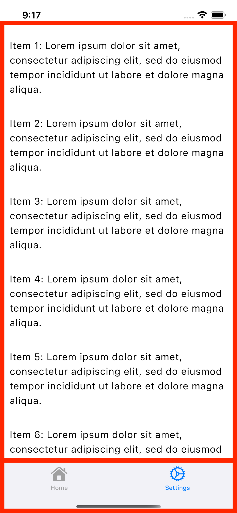
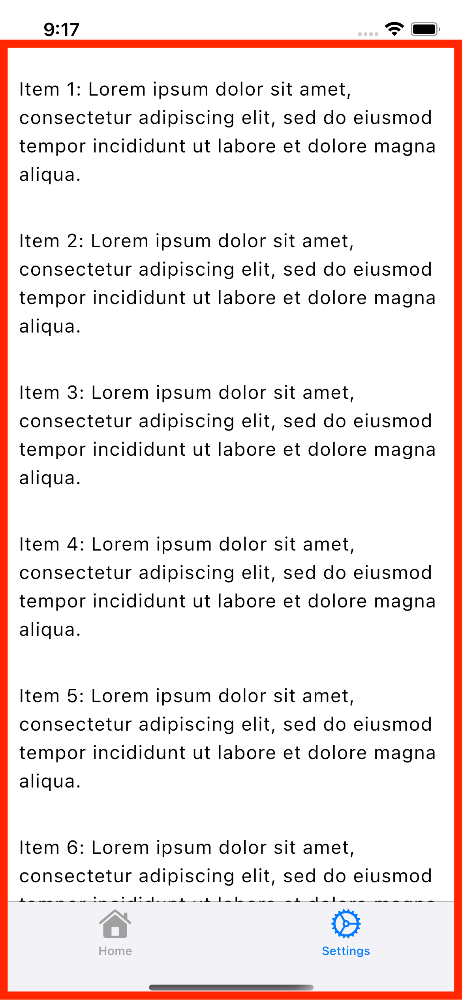
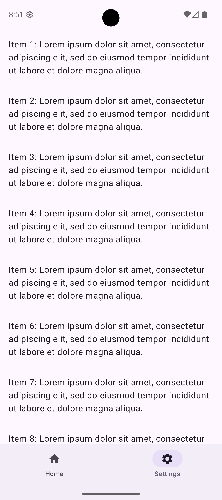
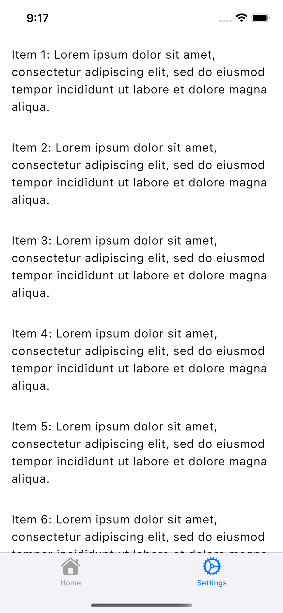
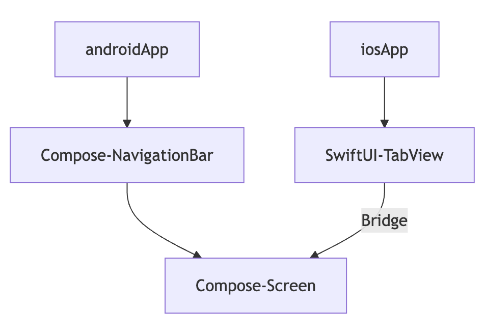
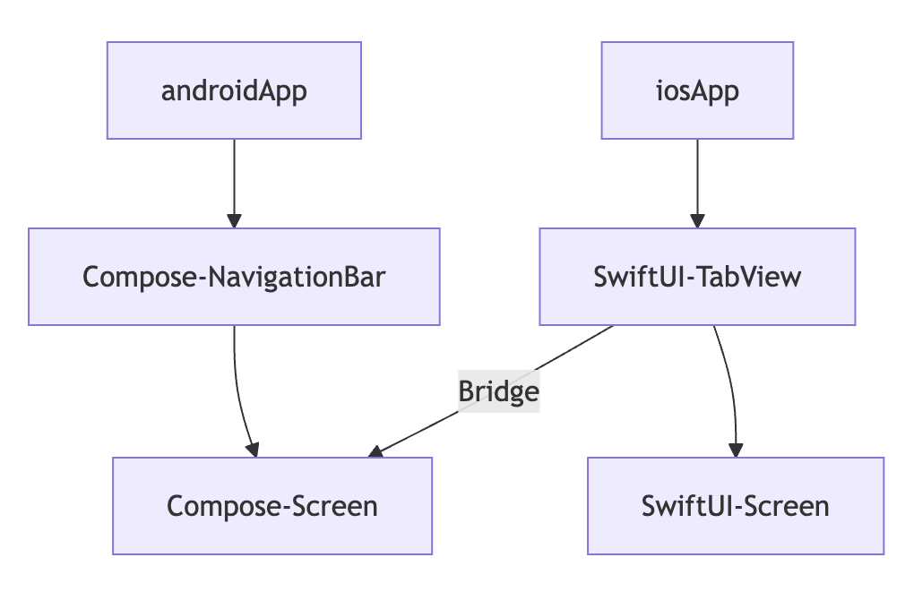
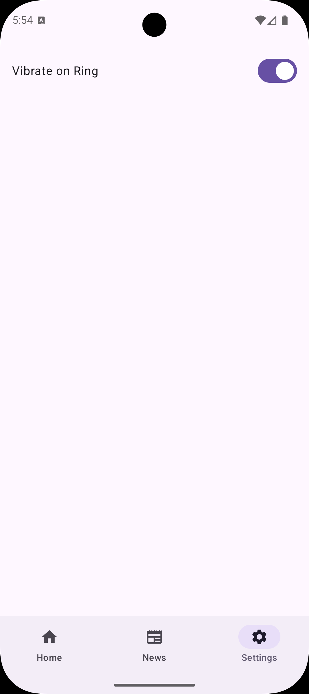
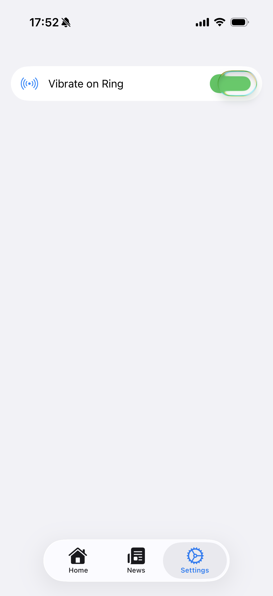

<div class="doc-header">
  <div class="doc-title">プラットフォームの境界線を見つけよう</div>
  <div class="doc-author">川島慶之</div>
</div>

 プラットフォームの境界線を見つけよう
==

## はじめに

Android アプリ開発では、Jetpack Compose（以下、Compose）<span class="footnote">Build better apps faster with
Jetpack Compose
 https://developer.android.com/compose</span>によって UI を記述できます。2010年代、複雑化する Android アプリにおいて、開発しやすくする Android Jetpack が2018年にリリースされました。以下は、リリース時の開発ブログからの引用です。

> Last year, we launched Android Jetpack, a collection of software components designed to accelerate Android development and make writing high-quality apps easier. Jetpack was built with you in mind -- to take the hardest, most common developer problems on Android and make your lives easier.<span class="footnote">What’s New with Android Jetpack and Jetpack Compose https://android-developers.googleblog.com/2019/05/whats-new-with-android-jetpack.html</span>


Jetpack Compose は、この Jetpack シリーズの一つとして UI を容易にそして高品質に開発できるようにと登場しました。Jetpack には、開発を加速させる願いが込められていて、Android のマスコットキャラ Droid 君がロケットを携えて描かれていたりします。この Compose はマルチプラットフォームに対応しており、Compose Multiplatform<span class="footnote">Build beautiful shared UIs for Android, iOS, desktop, and web that feel natural on every platform. https://kotlinlang.org/compose-multiplatform/</span> として iOS Desktop Web での動作もサポートしています。略称として CMP と呼ばれることもあります。

### 対象の読書
- モバイルアプリ開発に関わる人
- Compose Multiplatform の採用を考えている人

### 扱うプラットフォーム
この記事では、Android と iOS を扱います。

## プラットフォームとは
プラットフォームとは、アプリが動作する基盤環境のことです。デベロッパーがアプリを開発して配信し、ユーザがダウンロードしてスマホ上で動かす、この一連の全ての活動の基盤になります。モバイルアプリにおいては、Android と iOS を指します。この二大プラットフォームがモバイル市場を独占している状態となっていて、昨年はスマホ新法が施行されたことも記憶に新しいです。DroidKaigi 2025 で公正取引委員会からこれに関するセッション<span class="footnote">スマホ新法って何？１２月施行？アプリビジネスに影響あるの？ https://2025.droidkaigi.jp/timetable/981378/</span>もありました。セッションのタイトルの通り「スマホ新法って何？」と気になった人はアーカイブの視聴をおすすめします。

{width="160"}

スマホ市場の独占状態にあり、ユーザおよび開発者に対して、不利益や不利な条件を強制することも可能になっているとの懸念から、もしそういった困り事がある場合には相談を上げてもらい、公正取引委員会が是正措置に動くという内容でした。

プラットフォーム側でアプリを配信するためには審査があり、これの承認があって配信できるようになります。プラットフォームごとにガイドライン<span class="footnote">Android - Material Design https://m3.material.io/ iOS - Human Interface Guideline https://developer.apple.com/jp/design/human-interface-guidelines</span>は明示されており、これに準拠する必要があります。この前提がこの記事で扱っているプラットフォームの大きな特徴になります。

### iOS 対応の注意点
Compose Multiplatform を採用すると、つまり、Android アプリ向けのコードで iOS 上でも動作します。しかし iOS もターゲットとする際には注意が必要です。前述の通り、ガイドラインはプラットフォームごとに策定されており、同一のコードでガイドラインに準拠するのは限界があります。さらに iOS 26 から Liquid Glass<span class="footnote">Apple、楽しくて優雅な新しいソフトウェアデザインを発表 https://www.apple.com/jp/newsroom/2025/06/apple-introduces-a-delightful-and-elegant-new-software-design/</span>が発表されました。マルチプラットフォームを採用せずに iOS アプリの環境で開発している場合、OS 側で標準のコンポーネントに対して適宜適合してくれます。

Compose Multiplatform では、Compose が描画した内容を一つの `UIViewController`<span class="footnote">https://developer.apple.com/documentation/UIKit/UIViewController</span>として返します。そのため、各 UI コンポーネントを iOS 側から区別することはできません。

`UIViewController` について少し補足すると、
複雑化した Android アプリに Jetpack Compose が登場したように iOS アプリでも同じように複雑化に対して、SwiftUI が登場しました。それ以前は UIKit ベースの `UIViewController` が画面単位のライフサイクルを管理<span class="footnote">https://developer.apple.com/documentation/uikit/displaying-and-managing-views-with-a-view-controller</span>していました。SwiftUI であれば、様々な `View` を組み合わせて記述しますが、Compose Multiplatform では、一つの `UIViewController` として返ってくるため、一つの `View` で記述していると捉えてもらうとイメージしやすいと思います。

例えば、次のような画面では、太枠が一つの `View` になります。SwiftUI では、画面のコンテンツと `TabView` は別の View として定義されます。一方、Compose Multiplatform では、`TabView` と画面のコンテンツをまとめて一つの `View` として定義されます。

| SwiftUI | Compose Multiplatform |
|:-:|:-:|
|  |  |

そのため、前述の OS 側で Liquid Glass に適合する恩恵を受けることができません。図が示すように Compose Multiplatform においては、`TabView` の部分が存在していることに**なっていない**からです。

## Liquid Glass 対応
前述の説明で利用した、次のようなレイアウトを想定します。

| Android | iOS |
|:-:|:-:|
|  |  |

ここからは具体的に Compose Multiplatform に Liquid Glass を対応する方法を通してプラットフォームの境界について見ていきたいと思います。Liquid Glass の適用<span class="footnote">Adopting Liquid Glass - Navigation https://developer.apple.com/documentation/technologyoverviews/adopting-liquid-glass#Navigation</span>がわかりやすいように Navigation を用意します。

これから説明する Compose Multiplatform に Liquid Glass を適用したサンプルコードのリポジトリを公開しています。

{width="160"}

このレイアウトでは Compose の `NavigationBar`<span class="footnote">https://developer.android.com/develop/ui/compose/components/navigation-bar</span>を利用しています。

```kotlin
NavigationBar {
  val items = listOf(Screen.Home, Screen.Settings)
  items.forEach { screen ->
    NavigationBarItem(
      icon = { Icon(screen.icon, contentDescription = screen.label) },
      label = { Text(screen.label) },
      selected = currentScreen == screen,
      onClick = { currentScreen = screen }
    )
  }
}
```

### SwiftUI から Compose へのブリッジ

Compose `NavigationBar` の部分を SwiftUI `TabView` に置き換えたら Liquid Glass 対応できます。実際に `TabView` の中に表示する部分は Compose で共通利用したいです。そこで SwiftUI から Compose へのブリッジを用意します。図解すると次の図のようなイメージになります。



`ComposeUIViewController`<span class="footnote">https://kotlinlang.org/docs/multiplatform/compose-swiftui-integration.html#use-compose-multiplatform-inside-a-swiftui-application</span>を使うことで SwiftUI から Compose を `UIViewController` として利用できるようになります。

今回のケースでは、`HomeScreen` と `SettingsScreen` にそれぞれブリッジを用意しました。

```kotlin
fun homeViewController() = ComposeUIViewController {
  MaterialTheme {
    HomeScreen(paddingValues = PaddingValues(0.dp))
  }
}

fun settingsViewController() = ComposeUIViewController {
  MaterialTheme {
    SettingsScreen(paddingValues = PaddingValues(0.dp))
  }
}
```

これで Liquid Glass 対応の準備ができました。

1. Compose `NavigationBar` の部分を SwiftUI 側で `TabView` の宣言を追加する
2. SwiftUI からブリッジを経由して Compose Screen を呼ぶ

これによってプラットフォームの OS に合わせてシステム側が表現を調整してくれるようになります。次のように `ComposeView` として単一の `View` として扱っていたコードにブリッジを利用して SwiftView を経由してそれぞれの Screen を扱うように書き換えます。

```swift
struct ComposeView: UIViewControllerRepresentable {
  func makeUIViewController(context: Context) -> UIViewController {
    MainViewControllerKt.MainViewController()
  }
}

struct ContentView: View {
  var body: some View {
    ComposeView()
      .ignoresSafeArea()
  }
}
```

SwiftUI の `TabView` からそれぞれの Screen を割り当てます。

```swift
struct ComposeView: UIViewControllerRepresentable {
  // 常に MainViewController を返すのではなく
  // TabView で渡された ViewController を返すようにします
  let viewController: () -> UIViewController
  func makeUIViewController(context: Context) -> UIViewController {
    viewController()
  }
}

struct ContentView: View {
  var body: some View {
    // SwiftUI の TabView に対して
    // ブリッジで用意した ComposeUIViewController を割り当てています
    TabView {
      ComposeView(viewController: HomeViewControllerKt.homeViewController)
        .ignoresSafeArea()
        .tabItem {
          Label("Home", systemImage: "house.fill")
        }
      ComposeView(viewController: SettingsViewControllerKt.settingsViewController)
        .ignoresSafeArea()
        .tabItem {
          Label("Settings", systemImage: "gear")
      }
    }
  }
}
```

Compose Multiplatform に Liquid Glass 対応した結果を X にポストした動画のリンクです。

{width="160"}

### SwiftUI で完結

さらに、設定画面のような OS に近い部分で、プラットフォームの表現に近づけたい場合やプラットフォーム固有のロジックが多い場合は、丸ごと Swift で書いてしまう方法もあります。ここまで見てきた構成であれば、`TabView` で Compose Screen ではなく、SwiftUI で記述した Screen を割り当てるだけで良いです。



```swift
struct ContentView: View {
  var body: some View {
    TabView {
      Tab("Home", systemImage: "house.fill") {
        ComposeView(viewController: HomeViewControllerKt.homeViewController)
          .ignoresSafeArea()
      }
      Tab("News", systemImage: "newspaper") {
        ComposeView(viewController: NewsViewControllerKt.newsViewController)
          .ignoresSafeArea()
      }
      Tab("Settings", systemImage: "gear") {
        // ComposeView ではなく、SwiftUI の Screen
        SettingsView()
      }
    }
  }
}
```

| Android | iOS |
|:-:|:-:|
|  |  |

## まとめ

このようにプラットフォームでの表現に合わせてマルチプラットフォームの境界を定めることができます。ユーザに対してどのような体験を提供したいか、アプリの世界観を重視するか、プラットフォームの世界観とシームレスに繋げるか。筆者としては、可能な限り後者に寄せておく方が時代の流れる方向と予想しています。Liquid Glass の前に UI から色が消えていく流行がありました。

> 突き詰めると、**すべてのUI要素に色がついている状況というのは実は必然ではない**、ということになってきます。ここから透明や脱色への志向が生まれているのではないかと自分は思っています。<span class="footnote">UIから「白」が消える日 https://note.com/ritar/n/n0f6aad6c2560</span>

Liquid Glass によって、アプリの要素はさらにプラットフォームに溶けていこうとしています。またプラットフォームに溶かすためにも Liquid Glass 対応に順応する構成が望ましいと考えています。その観点でマルチプラットフォームを採用する際もどこまでを共通化するか見定めていけたらと思っています。今回見てきたように Liquid Glass 対応を通して、コードベースにおいてどこにプラットフォームの境界を見つけるかが重要になります。
